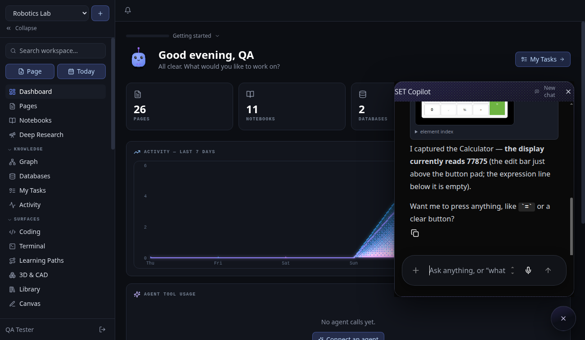
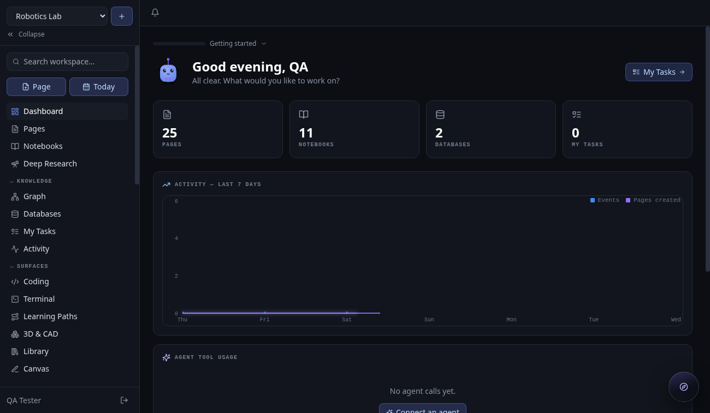

<div align="center">

# SET

### The self-hosted Knowledge + Learning Operating System

**Structured workspace · connected knowledge graph · grounded AI research with citations · an agent that can see your screen and use your apps**

[](./LICENSE)
[](#quick-start)
[](#connect-an-llm-byok)
[](#built-for-agents-not-just-humans)

*Your notes. Your graph. Your research. Your models. Your machine.*

</div>

---

```bash
$ git clone github.com/GucciGross/SETv2 set && cd set
$ cp .env.example .env && docker compose up -d
$ open http://localhost:8080        # that's it — Postgres, Redis, API, UI
```

---

## Why SET exists

Every team has the same problem: knowledge scattered across five tools, AI that
hallucinates because it can't see your documents, and learning that happens once
in an onboarding doc and is never revisited. SET is one self-hosted stack that
treats **knowledge, research, and learning as a single system** — with an agent
that is actually grounded in your content, and (optionally) can see and operate
your desktop when you ask it to.

| Layer | What you get |
|---|---|
| 📝 **Structured Workspace** | Rich block editor (TipTap) with tables, images, highlights, slash menu & `[[autocomplete]]`, relational databases with table/kanban/calendar/gallery views, spaces, roles & permissions |
| 🕸 **Knowledge Graph** | Wiki links with bidirectional backlinks, unlinked mentions, block references with permanent IDs, live force-directed graph, full Markdown round-trip, daily notes |
| 🔬 **Grounded Research** | Multi-source notebooks (PDF / web / transcripts / datasets), structure-aware chunking with human-in-the-loop correction, chat with inline `[1] [2]` citations, deep-research runs with a formatted paper view, knowledge views (mind map / tree / timeline / index) |
| 🎓 **Learning System** | Generated flashcards, quizzes, study guides & two-host audio overviews, SM-2 spaced repetition, learning paths with deadlines and per-member progress |
| 🤖 **AI Copilot** | Streaming agent runtime with workspace tools, human-in-the-loop approvals, generative UI (cards, tables, forms, quizzes, flashcards, 3D viewers) rendered natively in chat |
| 🖥 **Computer Use** *(new)* | The agent sees real desktop apps — annotated captures (screenshot + numbered element index) — and can click, type and scroll **only** with your explicit opt-in, action-by-action approval |

### Optional work surfaces — power features are opt-in

Toggle per workspace in Settings. Not a CAD person? You'll never see the 3D surface.

`Coding` (editor + sandboxed JS runner) · `Terminal` (workspace console with grounded search) · `3D & CAD` (GLB/STL/OBJ, URDF robotics with animated joints, STEP import) · `Library` (curated HuggingFace datasets importable into notebooks) · `Learning Paths` · `Canvas` (infinite-canvas spatial view)

---

## The agent that uses your computer

Phase 4 shipped a full computer-use loop for Linux desktops (macOS/Windows via
the same driver), adapted from the [hermes-agent](https://github.com/NousResearch/hermes-agent)
computer-use stack (MIT, Nous Research) onto SET's companion architecture:

```
You:     "Use screen_capture on the Calculator and tell me what the display shows."

Copilot: [screen_capture → screenshot + 404-element index renders in chat]
         "The display shows 77875, and you're in Scientific mode."

You:     "Click the 7 button."

Copilot: [screen_act → click element [202] → fresh capture]
         "Done — display went 77875 → 778757."
```



**How it works.** Your local **teaching companion** (a small Python process on
your machine) pairs with your SET instance via a revocable token and speaks to
[cua-driver](https://github.com/trycua/cua-driver-rs). `screen_capture` returns
a grounding pair: a downscaled screenshot *and* an AT-SPI element index —
`[199] push button "5" (156,359 64x44)` — so **vision and non-vision models can
both act** (vision routing decides, per model, whether the image rides along).
Every action is followed by an automatic re-capture so the agent verifies its
own effects instead of trusting them.

**Safety is layered, and defaults to watching, not touching:**

| Layer | Behavior |
|---|---|
| Observe-only default | Captures, element indexes and demos work with input actions **off** |
| Machine opt-in | Clicks/typing require the companion started with `SET_ALLOW_INPUT=1` |
| Action approval | Write actions can require per-call Approve/Reject in the chat |
| Revocable pairing | Kill the companion's token in Settings anytime |
| Honesty | Driver `effect: unverifiable` verdicts are surfaced so the model re-grounds instead of assuming success |

---

## Built for agents, not just humans

SET speaks the **Model Context Protocol** natively — 26 tools, grounded
citations, OAuth 2.1 consent. Connect Claude, ChatGPT, Cursor or any MCP client
in under a minute from `/agents`. The same engine backs the built-in copilot:
`search_workspace`, `read_page`, `create_page`, `append_to_page`,
`search_knowledge` (hybrid RRF), `generate_study_material`, `screen_capture`,
`screen_act`, `render_ui`, and more — with streaming AG-UI events, tool results
rendered as rich UI, and write-tools behind human approval.

---

## Quick start (Docker)

```bash
cp .env.example .env        # set JWT_SECRET for production
docker compose up -d        # server + web + Postgres(pgvector) + Redis
open http://localhost:8080
```

Register an account (first user), or seed a full demo workspace:

```bash
SEED_DEMO=1 docker compose up -d    # login: demo@set.local / demo-demo
```

The demo ships linked pages, an experiments database with all four views, an
indexed research notebook (chat-ready with zero LLM setup), a learning path,
and an animated URDF robot arm in the 3D viewer.



### Connect an LLM (BYOK)

Everything except chat/generation works with no LLM at all (search and
embeddings fall back to a deterministic built-in hash index). For the full
experience add any OpenAI-compatible provider in **Settings → AI Providers**:

| Provider | Base URL | Notes |
|---|---|---|
| Ollama (local) | `http://host.docker.internal:11434/v1` | `ollama pull llama3.1` + `nomic-embed-text` |
| LM Studio | `http://host.docker.internal:1234/v1` | start the local server |
| vLLM | `http://your-host:8000/v1` | any hosted model |
| OpenAI / OpenRouter / Groq / Z.AI | official URLs | API key |

Or run Ollama inside the stack: `docker compose --profile ollama up -d`.

### Computer use setup (optional)

1. Install [cua-driver](https://github.com/trycua/cua-driver-rs) and start it: `cua-driver serve`
2. SET → **Settings → Companion** → create a pairing token
3. Run the companion on your desktop:
   ```bash
   cd companion
   SET_URL=http://localhost:8080 COMPANION_TOKEN=<token> python3 companion.py
   # add SET_ALLOW_INPUT=1 to permit clicks/typing (still approval-gated)
   ```
4. Ask the copilot to look at (or operate) a desktop app.

### Local development

```bash
docker compose up -d db redis      # Postgres + Redis
cd server && npm install && npm run dev    # API on :4000
cd web && npm install && npm run dev       # UI on :5173, proxies /api
```

`npm run migrate` (server) · `SEED_DEMO=1 npm run seed` · `npm test` ·
`node smoke.mjs` (54-check API smoke suite)

---

## Architecture

```
┌─ Web (React + Vite + Tailwind) ──────────────────────────────┐
│  TipTap editor · Graph view · DB views · Notebooks · 3D      │
│  Copilot panel (AG-UI client, A2UI + computer-use renderers) │
└──────────────┬───────────────────────────────────────────────┘
               │  /api (REST + SSE) · /ws (live sync + presence)
┌─ SET Server (Node.js + TypeScript + Fastify) ────────────────┐
│  Auth/JWT · Spaces & roles · Pages & wiki-links · Databases  │
│  RAG engine (hybrid RRF search, grounded citations)          │
│  Agent runtime + HITL approvals + vision routing             │
│  Study generator + SM-2 SRS · 3D/URDF manager · MCP server   │
│  LLM router (OpenAI-compatible, BYOK)                        │
└──────┬───────────────┬───────────────┬───────────────────────┘
       │               │               │
  Postgres        Redis pub/sub    Your LLMs
  (+pgvector)     (collab/WS)      Ollama · vLLM · OpenAI · …

  Companion (user's machine) — pairs via revocable token,
  executes teach demos + computer use through cua-driver:
  capture (screenshot + AT-SPI index) · click · type · scroll
```

### How grounding works

1. Sources are parsed (PDF text extraction, web fetch + boilerplate strip, raw text).
2. A structure-aware chunker splits along headings/paragraphs with size budget + overlap.
3. Chunks are embedded with your embedding model — or the built-in hash index (zero-LLM mode).
4. Retrieval fuses Postgres full-text and vector cosine via Reciprocal Rank Fusion.
5. Answers must cite inline `[1] [2]`; clicking a citation shows the exact chunk.
6. Humans can inspect and correct any chunk, then re-embed it.

Optional **RAGFlow** integration: point a notebook at a RAGFlow dataset and
retrieval routes through its deep-document-understanding chunks, with graceful
fallback to the built-in engine.

### Repository layout

```
server/            Node.js + TypeScript backend (Fastify + Postgres)
  src/agents/      AG-UI runtime, tools, vision routing, HITL approvals
  src/copilotkit/  CopilotKit/AG-UI adapter (SSE events, protocol envelopes)
  src/rag/         chunker, hybrid search (RRF), grounded chat
  src/llm/         BYOK provider management + OpenAI-compatible router
  src/study/       flashcards/quiz/study-guide/audio generation + SM-2
  src/models3d/    GLB streaming + URDF kinematic parser
  sql/             migrations
companion/         local teaching + computer-use agent (pairs with your SET)
web/               React + Vite + Tailwind frontend
scripts/qa/        CDP browser harness for real-browser QA
docker-compose.yml single-command self-host
```

---

## Roadmap

- **Phase 0 — Foundation** ✅ Docker Compose, block editor, databases, bidirectional links + graph, BYOK LLM, grounded RAG chat, copilot runtime
- **Phase 1 — Research strength** ✅ multi-source notebooks, chunk inspection + correction, high-precision citations, knowledge views, study materials, learning paths
- **Phase 2 — Collaboration + agents** ✅ live sync + presence, A2UI generative UI, HITL agents, team spaces, MCP server
- **Phase 3 — Interactive learning** ✅ 3D environments, URDF robotics with joint animation, native desktop teaching demos
- **Phase 4 — Computer use** ✅ agent screen capture (annotated), clicks/typing/scroll with layered consent, vision routing for mixed model fleets
- **Shipped follow-ups** ✅ capture history gallery, companion doctor + live health heartbeats, multi-window targeting notes, capture retention controls, LLM gateway (metered "SET Cloud" provider with per-workspace token/spend caps — `docker-compose.cloud.yml`)
- **Next** — browser-route unification, hosted cloud + Stripe metered billing on top of the gateway

## Monetization model

Self-hosting is **free forever** (AGPL-3.0) — that's the promise. An optional
hosted cloud runs the same core for teams that want zero ops, plus an optional
bundled LLM API. Same export-anytime guarantee everywhere.

## License

Copyright (C) 2026 SET contributors.

SET is free software: you can redistribute it and/or modify it under the terms
of the **GNU Affero General Public License v3.0** (see [LICENSE](./LICENSE)) —
the license choice protects against closed commercial forks while keeping the
project fully open. Dual/commercial licensing available for hosted/enterprise use.

Computer-use concepts adapted from [hermes-agent](https://github.com/NousResearch/hermes-agent)
(MIT © Nous Research). Desktop automation by [cua-driver](https://github.com/trycua/cua-driver-rs).
Mascot concept inspired by the Apache-2.0 OpenMausBot project.
